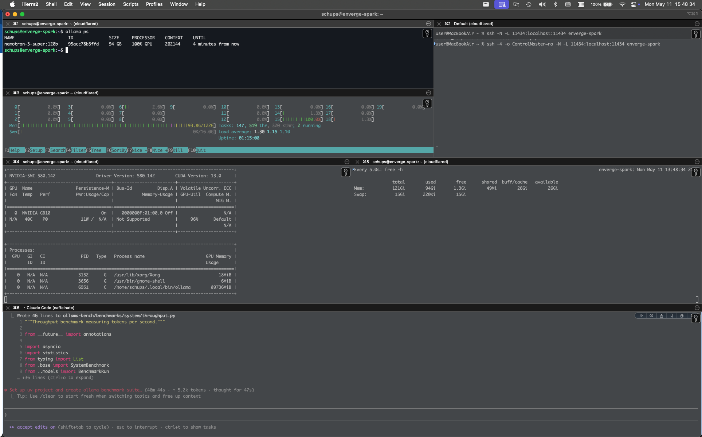

# dgx-spark-test

Standalone microbenchmarks comparing scaled-dot-product attention (SDPA) throughput on **GH200** (Alps/CSCS) vs **DGX Spark** (enverge.ai), to assess whether DGX Spark is viable as a host for locally-served LLMs powering coding agents. See `CLAUDE.md` for benchmark details.

## Example: Claude Code against a local model on DGX Spark



The screenshot shows Claude Code running locally but routed to an Ollama-served `nemotron-3-super:120b` on a rented DGX Spark via an SSH tunnel.

### 1. `~/.ssh/config`

```
Host enverge-spark
    HostName spark.enverge.dev
    User schups
    IdentityFile ~/.ssh/carth/ssh_key
    ProxyCommand cloudflared access ssh --hostname %h
```

### 2. Open the tunnel (forward Ollama's port 11434 to localhost)

```bash
ssh -4 -o ControlMaster=no -N -L 11434:localhost:11434 enverge-spark
```

### 3. On the remote host, serve the model

```bash
ollama run nemotron-3-super:120b
```

### 4. Locally, point Claude Code at the tunnel and launch it

```bash
export ANTHROPIC_BASE_URL="http://localhost:11434"
export ANTHROPIC_AUTH_TOKEN="ollama"
export ANTHROPIC_MODEL="nemotron-3-super:120b"
claude --model nemotron-3-super:120b
```
