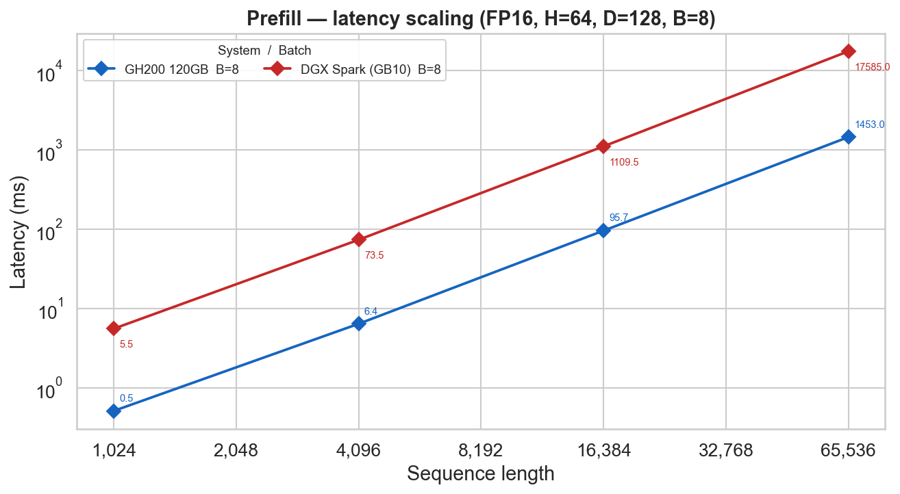
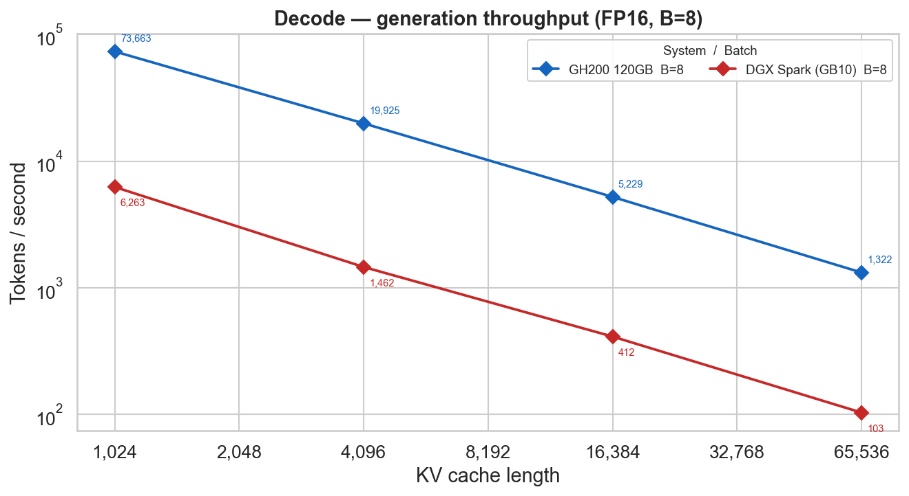
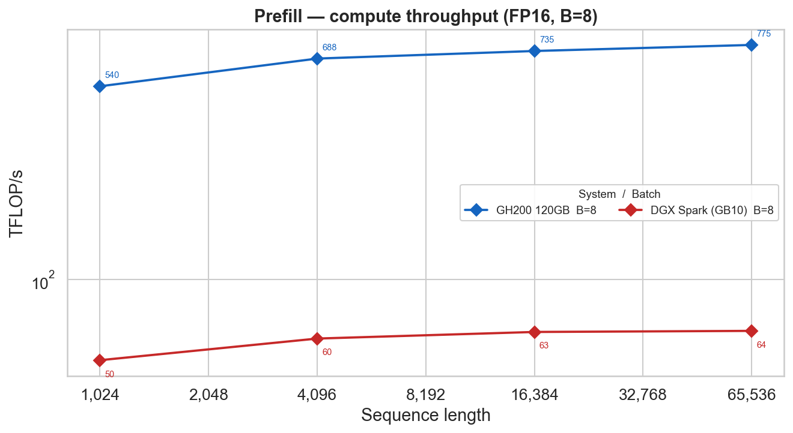
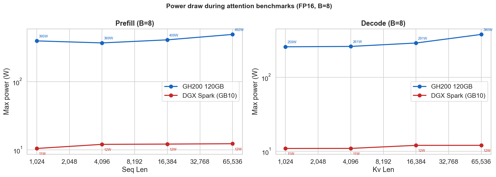
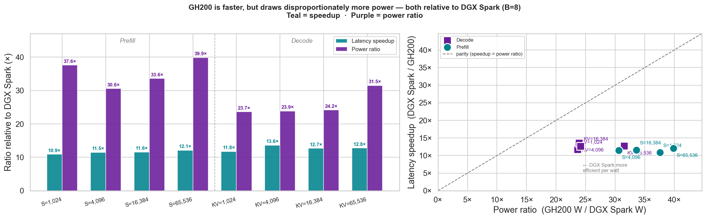

# DGX Spark test

Standalone microbenchmarks comparing scaled-dot-product attention (SDPA) throughput on **GH200** (Alps/CSCS) vs **DGX Spark** (enverge.ai), to assess whether DGX Spark is viable as a host for locally-served LLMs powering coding agents. See `CLAUDE.md` for benchmark details.

> *This work was driven by individual curiosity, and carried out in my free-time.*

## Running the benchmarks

Both platforms use the same NGC container (`nvcr.io/nvidia/pytorch:26.04-py3`) and the same core script (`run_benchmarks.sh`). Results land in `results/` prefixed by context tag and dtype, e.g. `results/spark_fp16_prefill_attention_results.csv`.

The sweep covers two attention regimes at FP16:

| Script | Regime |
|---|---|
| `benchmark_prefill_attention.py` | Full-sequence (prefill) |
| `benchmark_decode_attention.py` | Single-token / KV-cache (decode) |

### On Alps (GH200, CSCS)

Submit via Slurm. The job runs inside the NGC container through `srun --environment`:

```bash
sbatch run_benchmarks_on_alps.sh
```

Monitor the job:

```bash
squeue --me
tail -f results/slurm_job-<jobid>.out
```

Results are written to `results/slurm_*.csv`.

### On DGX Spark (enverge.ai)

Run:

```bash
./run_benchmarks_on_dgxspark.sh
```

This pulls `nvcr.io/nvidia/pytorch:26.04-py3`, mounts the repo into the container, and executes `run_benchmarks.sh spark`. Results are written to `results/spark_*.csv`.

### Quick single-cell check

To verify the setup before committing to a full sweep (works on either platform inside the container):

```bash
python benchmark_prefill_attention.py --batch-sizes 1 --seq-lens 1024 --warmup 2 --iters 5
python benchmark_decode_attention.py  --batch-sizes 1 --kv-lens  1024 --warmup 2 --iters 5
```

---

## Results (FP16)

*Benchmark results analysis prepared by [Claude](https://claude.ai).* See [`results/analysis.ipynb`](results/analysis.ipynb) for more details.

> **Important:** the results were collected by benchmarking the fundamental operations involved in LLMs — specifically the scaled-dot-product attention (SDPA) kernel — not by running real LLMs through an inference engine. A full LLM forward pass additionally includes embedding lookups, feed-forward layers, layer norms, KV cache management, sampling, and framework overhead, all of which affect real-world throughput. The tok/s figures reported here reflect raw attention kernel throughput only and will not match what a production serving stack such as vLLM or TensorRT-LLM would deliver on the same hardware. They are meaningful for comparing the two GPUs relative to each other, not as absolute predictions of LLM serving performance.

Benchmarks run at FP16, 64 heads, head-dim 128.

### Headline numbers (B=8)

| Metric | GH200 120GB | DGX Spark (GB10) | Ratio |
|---|---|---|---|
| Prefill latency at S=65 536 | 1 453 ms | 17 585 ms | GH200 **12.1×** faster |
| Prefill TFLOP/s at S=65 536 | 775 | 64 | GH200 **12.1×** higher |
| Decode latency at KV=65 536 | 6.05 ms | 77.3 ms | GH200 **12.8×** faster |
| Decode throughput at KV=65 536 | 1 322 tok/s | 103 tok/s | GH200 **12.8×** higher |
| Peak power draw (prefill, S=65 536) | 491 W | 12.3 W | GH200 **39.9×** more power |
| Peak temperature | 49 °C | 39 °C | — |

### Memory bandwidth as the unifying explanation — and its limits

The ~12× speedup is **constant across both regimes and all sequence lengths**, despite decode being memory-bound and prefill being compute-bound. The GH200's HBM3 (~3.35 TB/s) is 12.3× faster than the GB10's LPDDR5x (~273 GB/s); the observed decode speedup of 12.8× matches this directly. For prefill, the GH200 achieves 775 TFLOP/s vs the GB10's 64 TFLOP/s — also ~12×. The two GPUs happen to share the same compute-to-bandwidth ratio, making the gap a stable constant independent of workload shape.


*Prefill latency (B=8): quadratic scaling, consistent ~12× gap across all sequence lengths.*


*Decode throughput (B=8): the ~12× gap holds at every KV cache length.*

**What memory bandwidth cannot explain:**

- **Asymmetric compute scaling.** The GH200's TFLOP/s grows from 357 to 775 as sequence length increases (18% → 39% of theoretical peak), while the GB10 saturates at 64 TFLOP/s by S=4 096 and stalls. The GB10 is near its practical ceiling even at moderate sizes; the GH200 has substantial unexploited parallelism at small sequences that better kernels or larger batches could recover.


*Prefill TFLOP/s (B=8): the GH200 scales across the full range; the GB10 plateaus early.*

- **Divergent power behaviour.** The GH200 ramps from ~100 W to ~490 W as sequence length grows; the GB10 moves from 4 W to 12 W and barely flinches. This is an architectural difference — server-class GPU vs thermally-constrained integrated chip — not a bandwidth effect.

### Surprising findings

- **The 12× gap never moves.** Decode and prefill being bottlenecked by different resources should produce different speedup ratios. They do not. The equal compute-to-bandwidth ratio between the two systems makes this collapse happen, and it is not obvious from the datasheets alone.

- **The DGX Spark is thermally inert under load.** 12 W, 39 °C at full 65 536-token attention — no throttling, no ramp. The original concern motivating this benchmark is definitively answered: the GB10 does not throttle under sustained agentic workloads.

- **The GH200 has ample headroom.** Power cap is 900 W; it peaked at 491 W. These are genuine sustained numbers, not a ceiling-limited result.


*Power draw (B=8): GB10 is nearly flat; GH200 ramps but stays well below its 900 W cap.*

### Power efficiency


*Teal = latency speedup, purple = power ratio — both relative to DGX Spark. All points in the scatter plot fall well below the parity diagonal: the GH200 consumes power disproportionately compared to the performance it returns.*

The GH200 draws ~40× more power for a ~12× speedup, giving the DGX Spark a **~3× better performance-per-watt** advantage. For a continuously-running local deployment this is the dominant operational consideration.

### Is DGX Spark viable for locally hosted LLMs powering coding agents?

These benchmarks measure isolated attention kernels, so no definitive statement about end-to-end LLM serving performance can be made. What the data does establish:

- The GB10's attention throughput is consistently ~12× lower than the GH200's across all measured operating points. This gap will be present in any LLM workload where attention is a significant fraction of compute time.
- The GB10's practical TFLOP/s ceiling saturates early (~64 TFLOP/s by S=4 096), leaving little room for improvement from longer sequences or larger batches. This is a structural constraint, not a tuning problem.
- The GB10 runs at ~12 W and 39 °C under sustained full-context attention load, with no throttling. Thermal stability under continuous operation is confirmed.
- The GB10 delivers ~3× more attention compute per watt than the GH200 — a real, measurable efficiency advantage that would carry over to any workload dominated by attention.

Whether the GB10's absolute throughput is *sufficient* for a given agentic use case depends on the model size, quantisation, inference engine, and concurrency requirements — none of which are captured here. These results establish the hardware's attention-layer characteristics; validating full LLM serving on the DGX Spark would require a separate benchmark with an actual model and inference stack.

---

## Example: Claude Code against a local model on DGX Spark


The screenshot shows Claude Code running locally but routed to an Ollama-served `nemotron-3-super:120b` on a rented DGX Spark via an SSH tunnel.

### 1. `~/.ssh/config`

```
Host enverge-spark
    HostName spark.enverge.dev
    User schups
    IdentityFile ~/.ssh/carth/ssh_key
    ProxyCommand cloudflared access ssh --hostname %h
```

### 2. Open the tunnel (forward Ollama's port 11434 to localhost)

```bash
ssh -4 -o ControlMaster=no -N -L 11434:localhost:11434 enverge-spark
```

### 3. On the remote host, serve the model

```bash
ollama run nemotron-3-super:120b
```

### 4. Locally, point Claude Code at the tunnel and launch it

```bash
export ANTHROPIC_BASE_URL="http://localhost:11434"
export ANTHROPIC_AUTH_TOKEN="ollama"
export ANTHROPIC_MODEL="nemotron-3-super:120b"
claude --model nemotron-3-super:120b
```
